# carritos
Gestión de carritos de portátiles para IES de la Junta de Andalucía

# Roadmap del Proyecto

## Mejoras que podrian realizarse en futuras versiones

  - [ ] En Planificación y Reservas, si un día tiene las franjas de 1,2,3,4,5 y 6 reservadas (sin contar el recreo), el día en el calendario debe de pintarse de rojo.

  - [ ] En Planificación y Reservas, al hacer click en un botón de franja horaria, su caja de texto de reserva debe de cambiar de color, para identificar la franja horaria que se está modificando.
 
### [09-07-2023]

  - [ ] Manual de funcionamiento.

  - [ ] Configuración de instalación mediante setup.py

### [08-07-2023]

  - [X] Ajustes en el Modelo E-R final:

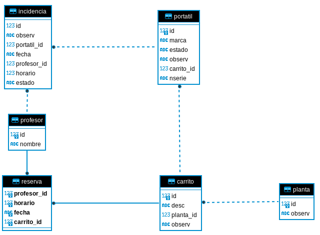

  - [X] En Incidencias, implementar opción de visualizar todas las incidencias o solo las abiertas.

  - [X] En Incidencias, implementar opción de visualizar todas las incidencias o solo las incidencias de del curso escolar (de septiembre a junio).

  - [X] En Incidencias, al crear una incidencia se debe de identificar en el titulo de la ventana. Si es una modificación se debe de indicar en el título de la ventana.

  - [X] En Informes, implementar informes para consultas de:  

     * Incidencias abiertas, por curso escolar actual.
     * Incidencias cerradas, por curso escolar actual.
     * Planificación de reservas de portátiles, por curso escolar actual.
     * Todo el profesorado.
     * Todos los portátiles.
     * Todos los carritos.

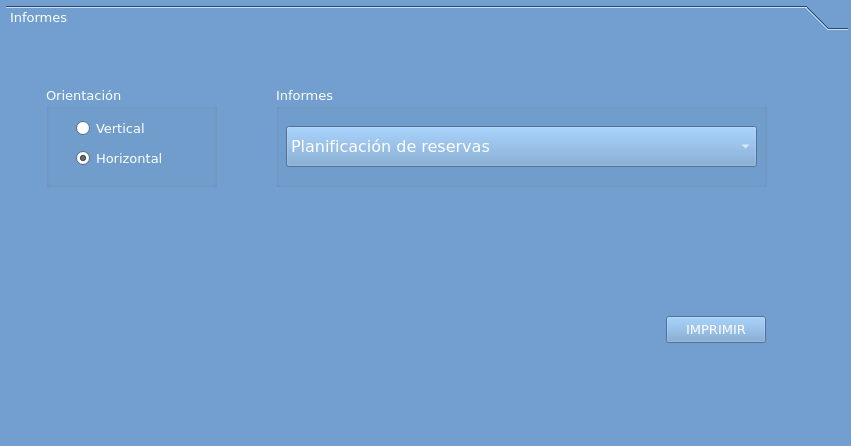

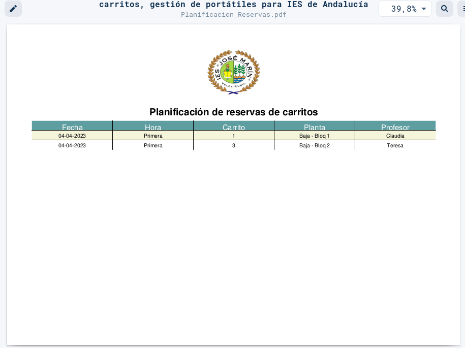

### [07-07-2023]

  - [X] Se finaliza la opción de importar.
  
### [06-07-2023]

  - [X] Se replantea el sistema de configuración. 
       * Se guardará en un fichero de inicialización JSON datos como el nombre del IES, curso escolar y elementos de logos de la aplicación.
       * Se implementa opción de EXPORTAR e IMPORTAR base de datos.
       * Si el fichero de BBDD no está la aplicación lo generará vacío, de nuevo, y mostrará un mensaje de dicha operación.
       * Si no se puede generar el fichero de BBDD la aplicación aborta, y no puede continuar.

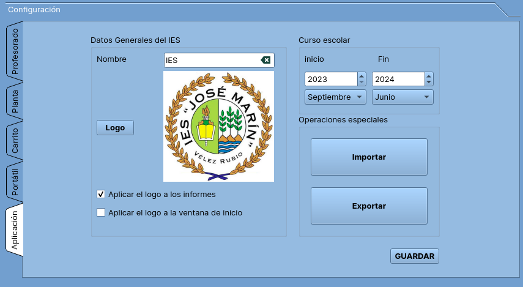

  - [X] No se implementan Tooltips, se deja para versiones posteriores.
  - [X] No se crean módulos de testing, el código de algunos módulos simplemente se comenta. 
  - [X] Franjas horarias pasarlas a datos hardcodeados. No tiene sentido guardarlas en la base de datos.
        --> Se mantienen en la BBDD, pero no se modifican. Están hardcodeadas.
  - [X] En Configuración, implementar lógica a las ventanas de configuración.
  - [X] En Planificación y Reservas, rellenar "Información", con información de los carritos.

### [05-07-2023]

  - [X] Separar clases de controlador en ficheros.
  - [ ] Crear un sistema de configuración, que contenga:

       * Nombre del IES
       * Curso escolar: Septiembre - Junio , Curso 
       * BBDD de prueba, para ver la DEMO.
       * Limpiar la BBDD. --> Operación peligrosa.
       * Crear backup de la BBDD.
       * Restaurar backup de la BBDD.
       * Crear BBDD limpia.
       Esta configuración se guardará en JSON.  

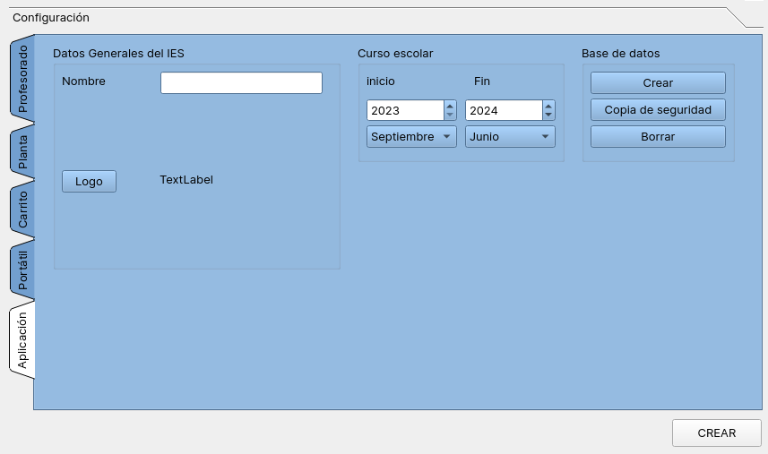

### [04-07-2023]

  - Cambio de diseño en tabla "portatil". El id (primary key) se cambia a INTEGER AUTOINCREMENT y se crea un nuevo campo "nserie", de tipo unique not null, que contendrá el número de serie del portátil.
    
      Tablas afectadas: portatil, incidencia
      
      Vistas afectadas: v_portatil, v_incidencias
  - Se elimina la tabla "horario", ya que los tramos horarios estarán hardcodeados. No es efectivo mantener una tabla que nunca va a variar.
      Tablas afectadas: horario, reserva, incidencia
      Vistas afectadas: v_horario (se elimina), v_incidencia, v_reserva

  - Los cambios en la BBDD afectan a como se recogen los datos de las columnas. Se hace necesario revisar el código que accede a estas entidades.

  - Se diseña la ventana de "Acerca de":

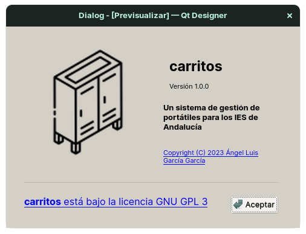

  - [X] Se implementa la funcionalidad de las ventanas de configuración del aplicativo:
     - [X] Portátiles
     - [X] Datos del IES
  - [X] Iconos de la aplicación.
  - [X] Rellenar datos de información para Carritos.
  - [X] Se configuran imágenes de inicio de la aplicación:
  
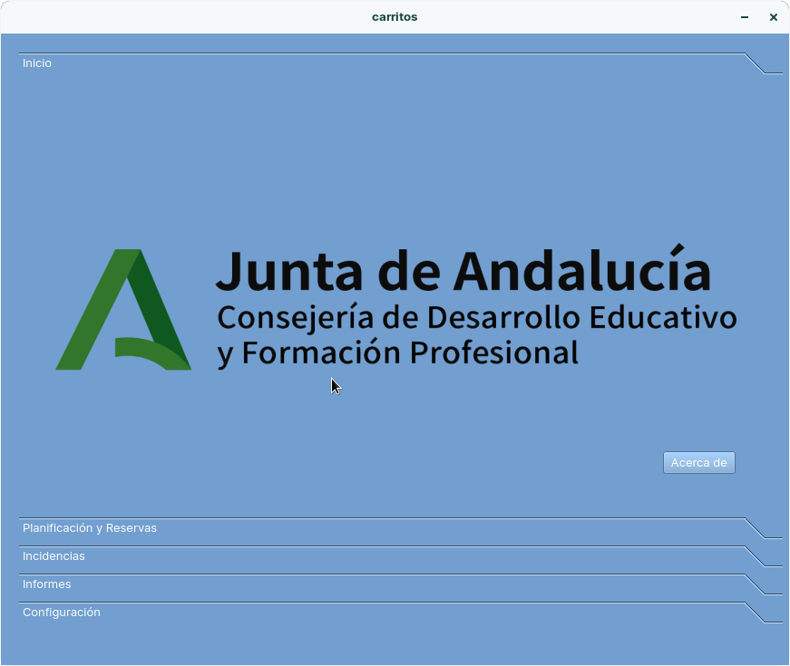  

### [02-07-2023]
  
  - [X] Se planifican los items mínimos para terminar la aplicación, con una funcionalidad aceptable.
  - [ ] Se implementa la funcionalidad de las ventanas de configuración del aplicativo:
     - [X] Profesorado
     - [X] Plantas
     - [X] Carritos
     - [ ] Portátiles
     - [ ] Datos del IES

### [28-06-2023]

  Implementación de informes:

  - [X] <strong>Reportlab</strong> para creación de informes en PDF. Se visualizará por pantalla a partir de la llamada a la aplicación por defecto para abrir PDF's, tanto en Windows como en Linux.
  - [ ] Exportación a CSV.
  
### [21-06-2023]

  - [X] Se diseñan pantallas de configuración.

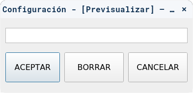

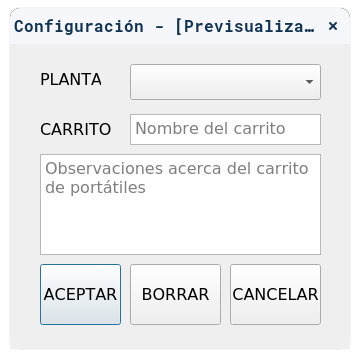

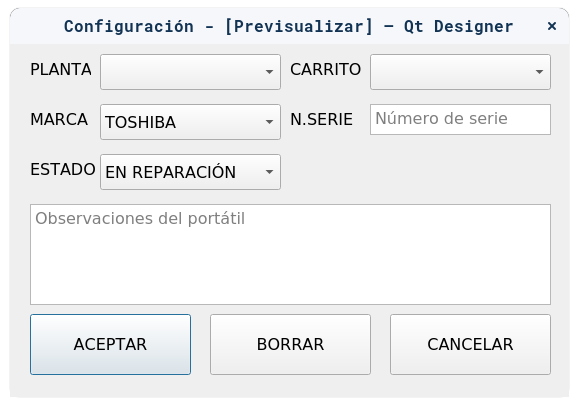
  
### [19-06-2023]

  - [X] Gestión de incidencias. 
     *  Se diseña por completo la gestión de incidencias. Se realizan pruebas
        y casos de uso. Todo correcto.

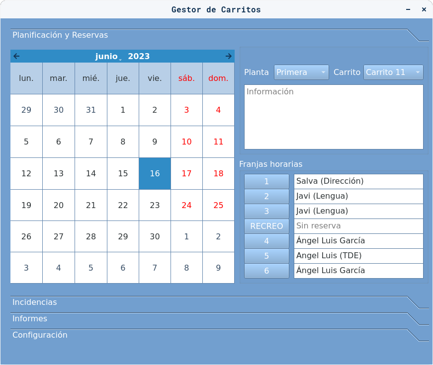

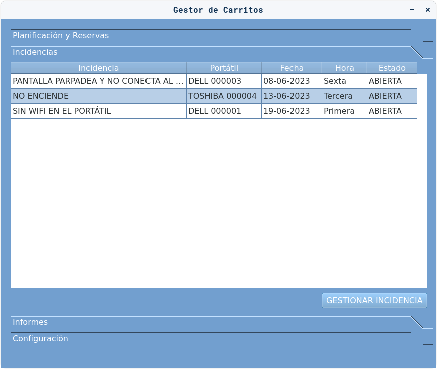

     Hacer click en botón "GESTIONAR INCIDENCIA" o doble click en alguna 
     incidencia, se visualiza el gestor de indicencias.

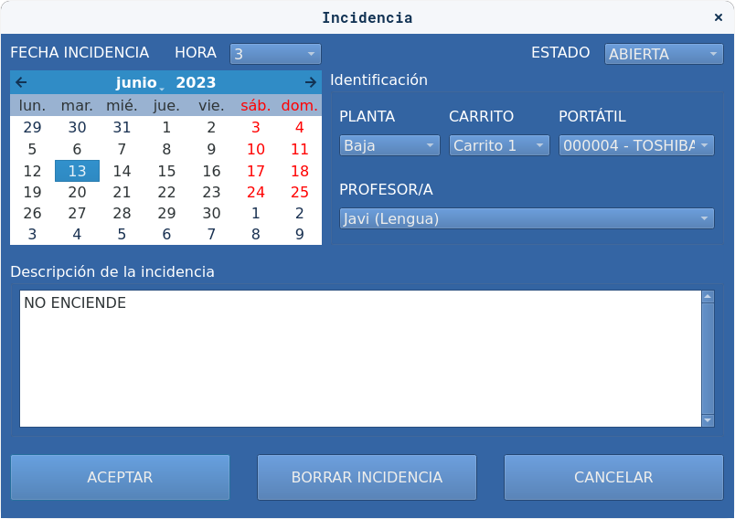
  
### [13-06-2023]

  - [X] Prototipo de incidencias.
  - [X] Determinar los estados de las incidencias: ABIERTA / CERRADA
  - [ ] Cambios de color en los estados: ABIERTA -> Color Verde, 
        CERRADA -> Color Rojo
  - [X] Incluir planta, carrito y portátil, para definir la incidencia (en 
        combos)

### [12-06-2023]

  - [X] Arquitectura del controlador. 
  - [X] Carga de combos Planta y Carrito. 
  - [X] Manejador de eventos para selección de fechas y creación de reserva.
     * Asignacón de nombre de profesor/a.

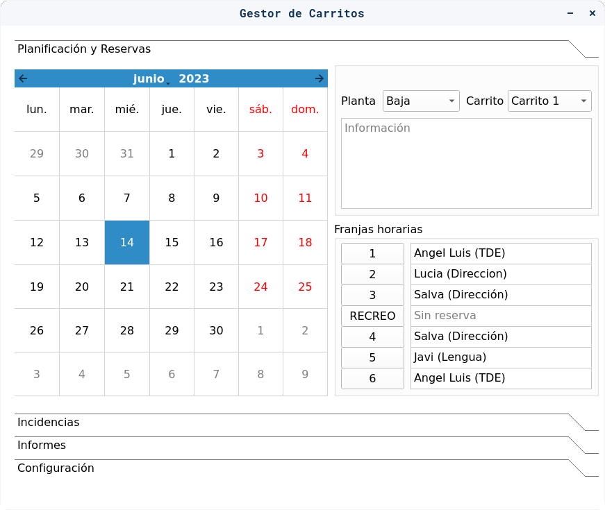

### [09-06-2023]

  - [X] Diseño de pantalla de configuración del aplicativo. 

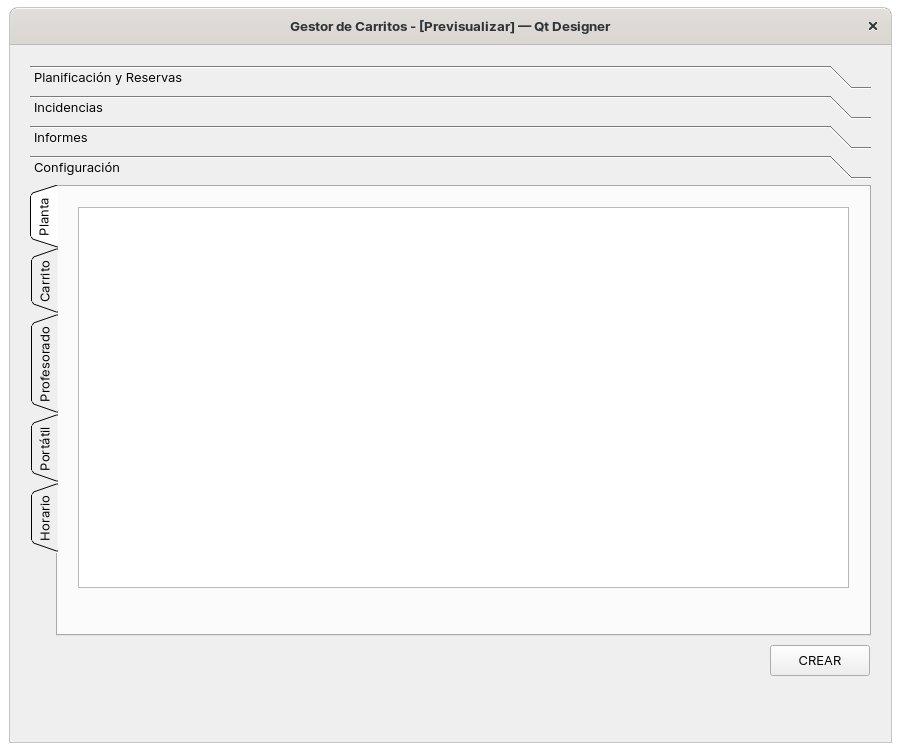

### [08-06-2023]

  - [X] Se renombra clase Base a Conexion, que hereda de clases Log y Bd.
  - [X] Se crea clase DMLCarrito, que contiene los métodos genéricos para
        actualizar, borrar, crear y visualizar entidades (tablas).
  - [X] Se plantea en este punto el usar SQLAlchemy, pero dado lo pequeño 
        del proyecto, se descarta.
  - [X] Clases profesor, planta, horario y carrito heredan ahora de DMLCarrito.
        Implica que cada clase tiene funcionalidad extra de gestión de su 
        entidad asociada en la base de datos.
  - [X] Se crea clase portatil, reserva e incidencia, que heredan de DMLCarrito.

### [07-06-2023]

  - [X] Módulo bd 
     - Clase Bd, que interacciona con una base de datos SQLite.
  - [X] Módulo log 
     - Clase Log, que genera texto en ficheros de registros de eventos .log.
  - [X] Módulo base 
     - Clase Base, heredada de Bd y Log, que será la clase padre de las clases
       que interaccionen con la base de datos.
  - [X] Se diseñan clases profesor, planta, horario y carrito.
        
### [06-06-2023]

  - [X] Ficheros UI generados con Qt Designer. 
     - Prototipos de la interfaz gráfica del proyecto.

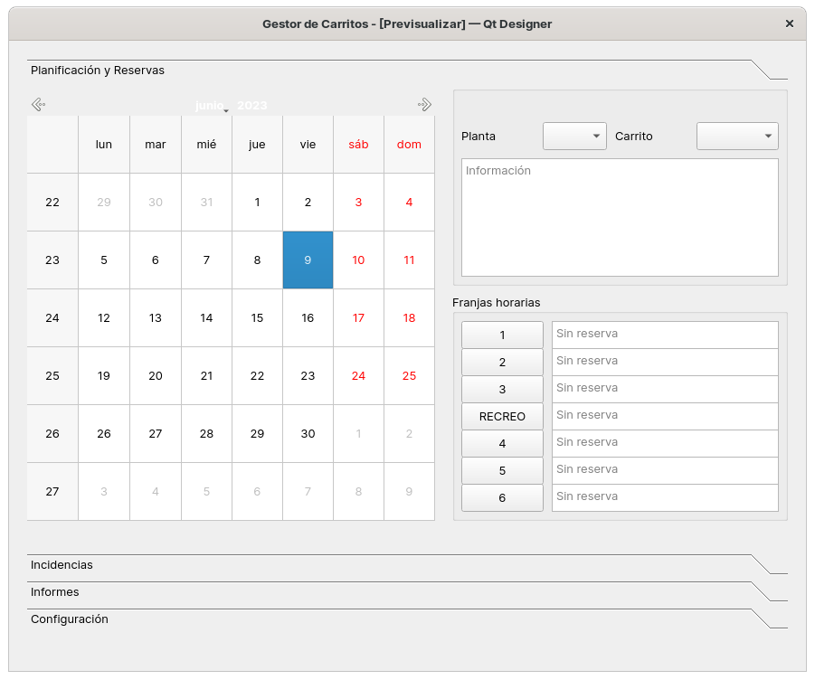

### [05-06-2023]

  - Se planifica la gestión de carritos de portátiles de un Instituto de Educación Secundaria (IES de aquí en adelante) de la Junta de Andalucía. 
  - La gestión se realizará mediante un aplicativo informático multiplataforma, que pueda ejecutarse en entornos Windows y Linux.
  - La gestión de carritos se lleva actualmente en papel, tanto las reservas como la gestión de incidencias. Esto hace que no siempre se solucionen todas las incidencias de todos los carritos del IES. Además, no hay un control exhaustivo de quien utiliza los carritos, ni se pueden sacar informes de uso de los mismos.
  - La trazabilidad del uso de portátiles no queda plasmada, y es por ende que se necesita normalizar el uso de los mismos, informatizando dicha gestión.

#### ¿Qué se quiere conseguir?

   1) Poder llevar una gestión de partes de incidencias de los portátiles de los carritos del IES.
  
   2) Realizar informes de roturas de portátiles.

   3) Informes de quien utiliza los portátiles.

   4) Sistema de planificación y reserva de portátiles.

#### Diagrama de Entidad - Relación

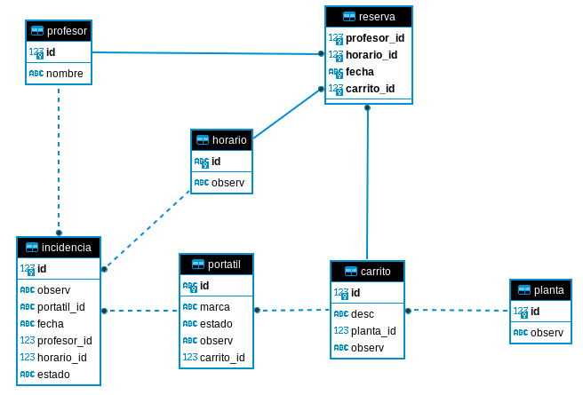

#### Carritos y portátiles

##### Conjunto de carritos de portátiles

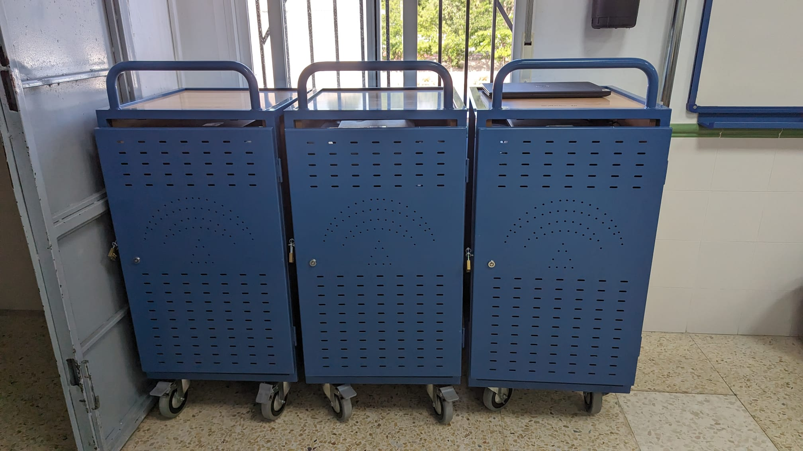

##### Identificadores de carritos de portátiles

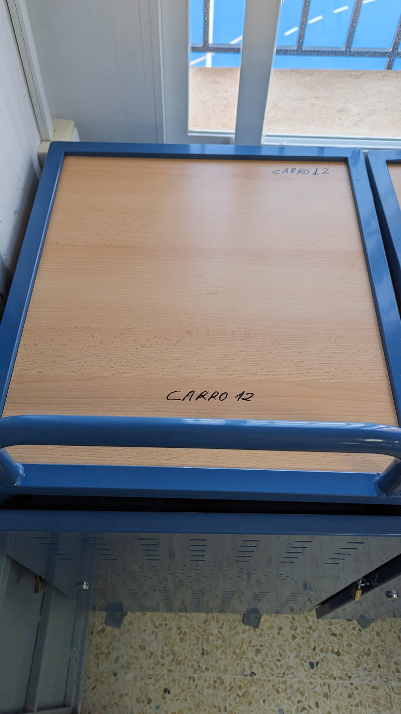

##### Portátiles

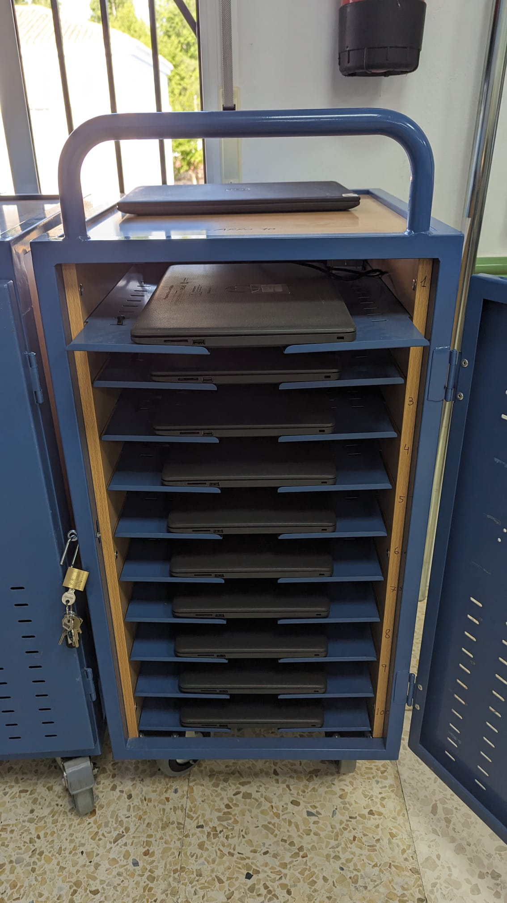