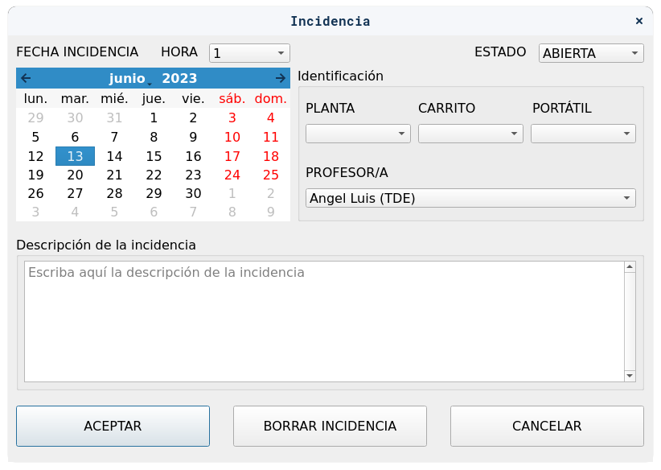

# carritos
Gestión de carritos de portátiles para IES de la Junta de Andalucía

# Roadmap del Proyecto

## Por hacer

  - [ ] Cambiar colores de cajas de texto  de franjas horarias al 
        editar las reservas.
  - [ ] Franjas horarias pasarlas a datos hardcodeados. No tiene sentido
        guardarlas en la base de datos.
     * ¿Dejar los datos harcodeados en la base de datos, de manera fija
       para mantener la integridad referencial?
  - [ ] Tooltip en botones de franjas horarias.
  - [ ] Rellenar datos de información para Carritos.
  - [ ] Sistema de configuración de datos de la aplicación.
  - [ ] Gestión de incidencias. 
  - [ ] Separar los test de los módulos, e incluirlos en alguna carpeta
        para no subirlos al repositorio.
  - [ ] Iconos de la aplicación.
  - [ ] Manual de funcionamiento.

### [13-06-2023]

  - [ ] Prototipo de incidencias.
  - [ ] Determinar los estados de las incidencias: ABIERTA / CERRADA
     * Cambios de color en los estados: ABIERTA -> Color Verde, 
       CERRADA -> Color Rojo
  - [ ] Incluir planta, carrito y portátil, para definir la incidencia (en 
        combos)

### [12-06-2023]

  - [X] Arquitectura del controlador. 
  - [X] Carga de combos Planta y Carrito. 
  - [X] Manejador de eventos para selección de fechas y creación de reserva.
     * Asignacón de nombre de profesor/a.

### [09-06-2023]

  - [X] Diseño de pantalla de configuración del aplicativo. 

### [08-06-2023]

  - [X] Se renombra clase Base a Conexion, que hereda de clases Log y Bd.
  - [X] Se crea clase DMLCarrito, que contiene los métodos genéricos para
        actualizar, borrar, crear y visualizar entidades (tablas).
  - [X] Se plantea en este punto el usar SQLAlchemy, pero dado lo pequeño 
        del proyecto, se descarta.
  - [X] Clases profesor, planta, horario y carrito heredan ahora de DMLCarrito.
        Implica que cada clase tiene funcionalidad extra de gestión de su 
        entidad asociada en la base de datos.
  - [X] Se crea clase portatil, reserva e incidencia, que heredan de DMLCarrito.

### [07-06-2023]

  - [X] Módulo bd 
     - Clase Bd, que interacciona con una base de datos SQLite.
  - [X] Módulo log 
     - Clase Log, que genera texto en ficheros de registros de eventos .log.
  - [X] Módulo base 
     - Clase Base, heredada de Bd y Log, que será la clase padre de las clases
       que interaccionen con la base de datos.
  - [X] Se diseñan clases profesor, planta, horario y carrito.
        
### [06-06-2023]

  - [X] Ficheros UI generados con Qt Designer. 
     - Prototipos de la interfaz gráfica del proyecto.

